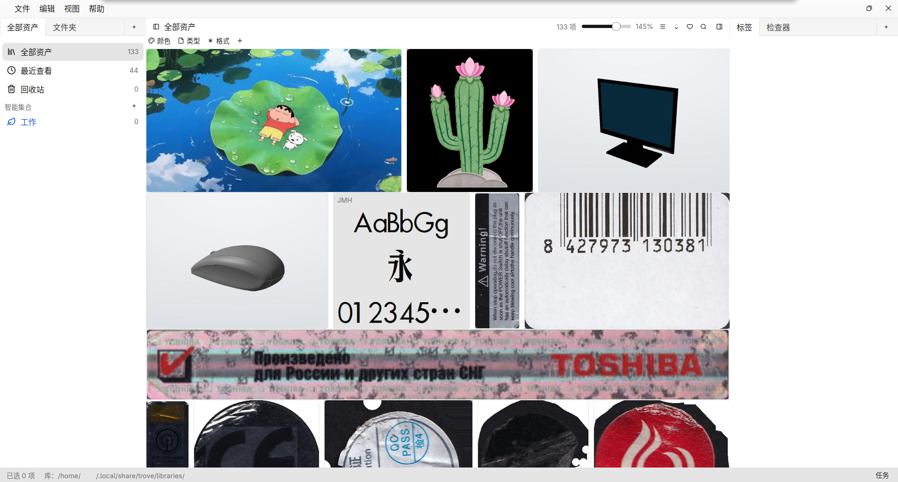

<h1 align="center">Trove</h1>

<p align="center"><b>Local · Private · Your own asset library</b></p>

<p align="center">
  <a href="./README.md">中文（主要文档）</a> ·
  <a href="./LICENSE">BUSL-1.1</a>
</p>

<br>

<p align="center">
  
</p>

<p align="center"><i>Justified grid · dock layout · 3D model viewport · visual search — all local, data never leaves your machine</i></p>

---

## ✨ Features

- **Search** — full-text + query expressions (qualifiers / AND-OR-NOT / phrases) + pinyin matching, freely combined with tag, rating and aspect filters
- **Visual search** — find by image or by color; fingerprints are computed at import, no AI inference involved
- **Organize** — hierarchical tags, smart collections, nested collection tree, ratings & favorites
- **Import** — drag-and-drop / paste / URL / watched folders / one-click collect from the browser extension; link only, never copy — files stay where they are
- **Preview** — images, video & audio with sound, live font specimens, RAW / HEIC / PSD / SVG, plus a GPU 3D viewport for OBJ / STL / PLY / glTF / GLB
- **Edit** — batch rotate / flip / crop, format conversion, XMP sidecar export, region screenshots straight into the library
- **Maintenance** — trash, BLAKE3 integrity check, daily auto backup, duplicate finder, multiple libraries
- **Localization** — 9 UI languages, switched live; follows the system by default

## 🎯 Who it's for

- **Designers & illustrators** — one home for reference images, PSD / SVG / fonts
- **Photographers & retouchers** — RAW support, rating and aspect filters, batch conversion
- **Collectors** — right-click to save web images, duplicates cleaned up in one pass

## 🚀 Quick start

Grab an installer from [Releases](https://github.com/panzhifu/trove/releases/latest) — every package ships the desktop app **and** the `trove` CLI:

| Platform | Download | Install |
|---|---|---|
| Debian / Ubuntu | `trove_<version>_amd64.deb` | `sudo apt install ./trove_*_amd64.deb` (Ubuntu 24.04+ / Debian 13+) |
| Fedora / openSUSE | `trove-<version>-1.x86_64.rpm` | `sudo dnf install ./trove-*.rpm` |
| Windows | `Trove-<version>-Setup.exe` | Guided installer with a Start-menu entry and an uninstaller |
| macOS (Apple Silicon / Intel) | `Trove-<version>-aarch64.dmg` / `Trove-<version>-x86_64.dmg` | Drag to Applications; unsigned — first launch **right-click → Open**, or `xattr -cr /Applications/Trove.app` |
| Other / portable | `trove-<version>-<target>.tar.gz` / `.zip` | Bare binaries (GUI + CLI), no desktop integration |

> Video preview, HEIC/AVIF decoding and PDF thumbnails rely on external tools (`ffmpeg`, `heif-dec`, any of `pdftoppm`/`mutool`/`gs`). The deb/rpm list them as recommended dependencies; when absent the affected features degrade gracefully and everything else keeps working.

Build from source:

```sh
git clone https://github.com/panzhifu/trove.git && cd trove
cargo run -p trove-app
```

> Needs the [Rust toolchain](https://www.rust-lang.org/tools/install). First launch opens a **welcome window**: name your library and go — storage locations follow platform conventions, there is no folder to pick. The **[Chinese README](./README.md)** is the canonical, most up-to-date document.

## ⌨️ Command line

A headless `trove` CLI shares the same data as the desktop app and can run while the app is open:

```sh
trove search 猫 --aspect wechat-cover
trove import ~/Pictures --into Reference
trove analyze --limit 50        # a vision model writes back description / tags / rating
trove doctor                    # library, index and ffmpeg self-check
```

Twenty subcommands in all; stdout is always one JSON document, and `--help` is the whole contract.

## 🛠 Development

```sh
cargo build
cargo test -p trove-core
```

Test and clippy baselines are green; per-module implementation notes live in a local `docs/` folder that is not part of the repository.

## 📄 License

Released under [BUSL-1.1](./LICENSE) (Business Source License 1.1):

- The source is open to view, modify and redistribute, and free to use for **non-production purposes**; production or commercial use requires a commercial license (contact in the repository);
- Each version converts automatically to [Apache-2.0](https://www.apache.org/licenses/LICENSE-2.0) four years after its release;
- From 2026-09-29 the whole repository (historical versions included) is republished under BUSL-1.1; MIT copies obtained before that date remain governed by MIT.
