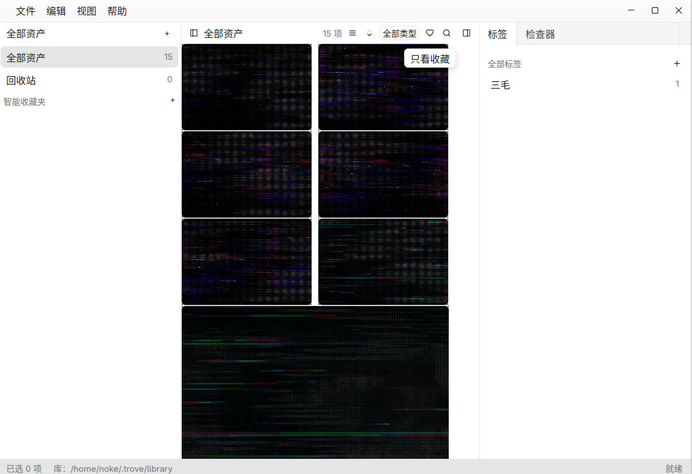

# Trove

> A local, private asset library — your photos, documents, audio and video in one searchable, taggable place.

Trove is a desktop asset manager built in Rust. It uses **[gpui-kit]** for the interface and **[rusqlite]** (SQLite) for single-file persistence. Assets are stored content-addressed on disk, so a file is stored exactly once no matter how it is organized.

[中文文档 (Chinese README)](./README.zh.md)

---

## Quick start

```sh
git clone https://github.com/panzhifu/trove.git && cd trove
cargo run -p trove-app
```

The first launch creates a library under the platform's config directory. Open **Settings** in the title bar to change the library location.

---

## Features

### Asset import
- Drag-and-drop files onto the window, or pick files from the system dialog.
- Content-addressed blob storage: identical files are deduplicated.
- Type probing and metadata mining on import — dimensions, duration, dominant color and more.
- **Smart collections automatically capture matching assets** — no manual sorting needed.

### Collections & tree navigation
- Nested collections form a tree with many-to-many asset membership.
- Cycle detection prevents accidental loops when moving folders.
- Cascading delete removes child folders.

### Asset types
- Images, videos, audio, documents, archives, **fonts** (ttf/otf/ttc/woff), and more — with per-kind icons in the grid.
- Import-time mining: EXIF, audio tags & duration, font family/style/weight, MP4 dimensions & duration; video posters via the system `ffmpeg` when available.

### Bulk selection
- Multi-select with Ctrl/Cmd+click or Shift range click; a floating toolbar offers favorite / add-to-collection / trash / clear.

### Tags & favorites & ratings
- Case-insensitive tags attach to any asset.
- One-click favorites and a 1–5 rating scale.

### Full-text search (FTS)
- Ranked full-text search over titles and descriptions, combined with any filter.
- Special characters are handled safely and literally.
- A maintenance command can rebuild the index after a migration.

### Visual search (v0.2)
- **Search by image**: find visually similar images using perceptual hash + color histogram.
- **Search by color**: find images matching a specific hex color (e.g. `#ff8000`).
- Visual signatures computed in background after import — no slowdown.

### Semantic search (CLIP, optional)
- Text-to-image search merged into the same search box: keyword (FTS) hits first, CLIP matches appended and deduplicated.
- Image-to-image search against CLIP embeddings in the visual-search panel.
- Embeddings are computed automatically after import; "Embed all" backfills existing images (Settings ▸ Search).
- Requirements (manual download, paths shown in Settings ▸ Search): the ONNX Runtime shared library, the CLIP ViT-B/32 ONNX model (`model.onnx`) and its BPE vocab (`bpe_simple_vocab_16e6.txt`) in the model directory.
- The model is English-caption trained — English queries match noticeably better than other languages.

### Smart collections
- Rule-based virtual folders defined as JSON query trees.
- Match on rating, kind, text, tag, favorite, color; combine with `and` / `or`.
- Trees are validated at compile time, and results support pagination.

### Trash & cleanup
- Deleted assets go to the trash, with restore at any time.
- Emptying the trash frees the underlying blobs and thumbnails.
- Orphan cleanup removes blobs no longer referenced by any asset.

### Drag & drop
- Drag files from the file manager onto the window to import.
- Drag assets onto a collection or the trash in the explorer.
- Drag assets onto a tag to tag them in bulk.
- Multi-select with Ctrl/Cmd+click; drag moves the whole selection.

### Context menus
- Asset: favorite, color label, reveal in file manager, add to collection, move to trash / restore / delete forever.
- Collection: new sub-collection, rename, delete.
- Tag: filter by tag, delete.
- Smart collection: delete.
- Inline editing: add/rename collections via Enter-to-confirm editors.

### Inspector
- Thumbnail preview with dynamic height based on image aspect ratio.
- Tags and mined color palette.
- Inline editing: title, description, source URL, kind, and a 1–5 star rating — committed on blur/Enter or click.
- Properties: MIME type, size, dimensions, added date, SHA-256, and a one-click reveal of the underlying file.
- Add or remove tags directly.

### Collection entry points
- **Paste & Import** (Ctrl+Shift+V): the clipboard image lands straight in the library.
- **Import from URL**: File ▸ Import from URL… downloads the file in the background and imports it, recording the source URL.
- **Watched folders**: Settings ▸ General lists watched roots; anything new under them imports automatically (unfiled). A folder is baselined on first sight — attaching a watch never retro-imports what is already there.
- **Import mode**: Settings ▸ General chooses between *copy into library* (default) and *link to original files* — linked assets stay where they are, keep a "Linked" badge in the Inspector and are revealed at their original path.

### Color labels & duplicate finder
- Per-asset **color labels** (red…purple) via the shared color-label widget: Inspector swatch row, grid context menu, and a **filter-by-color** dropdown in the grid toolbar; smart collections can match `color_label` too (including "no label").
- **Find Duplicates** (File menu): clusters visually identical images by perceptual hash (distance ≤ 8/64) and offers per-group "keep newest, trash the rest".

### Recently viewed & library health (0.3)
- **Recently viewed** system view (explorer sidebar): the last 200 assets you selected, most recent first; trashed assets drop out until restored; clear from the title bar.
- **Integrity check** (Settings ▸ Maintenance): recomputes the SHA-256 of every stored file and compares it with the record — flags missing and corrupted files, each with a one-click move-to-trash.
- **Smart collection fields**: captured date, aspect ratio and orientation join the rule builder alongside rating/kind/text/tag/size/color.

### Library safety & management
- **Automatic backups**: the database is snapshotted with SQLite `VACUUM INTO` into `backups/` at most once a day (on library open), rolling 10 files; Maintenance ▸ Backups snapshots on demand.
- **Recent libraries** for one-click hot switching, and a live **statistics** block (counts per kind, total size, tags, collections).

### Power tools (P1)
- **Batch rename** with a `{n}` (index) / `{name}` (file stem) pattern and a live preview — the whole batch is one undo step.
- **Hierarchical tags**: nest tags, filters/counts/smart collections include the whole subtree, deleting a parent promotes its children.
- **Library restore**: File ▸ Import library… rebuilds collections/tags/smart collections from an export; assets link by content hash or wait as placeholders that self-heal when the media is re-imported.
- **Local collect service**: `http://127.0.0.1:23916` accepts `POST /add` (raw bytes) and `POST /fetch` (server-side download) — collected files import automatically with their source URL (browser-extension ready).

### Design formats, folders & portability
- **SVG & PSD thumbnails**: SVGs rasterize (with text, via system fonts), PSDs composite their embedded preview — dimensions are mined at import.
- **Camera RAW & HEIC**: CR2/CR3/NEF/ARW/DNG/RAF/ORF/RW2 and friends decode through the rawler pipeline (demosaic → white balance → sRGB, orientation-aware); HEIC/HEIF converts via the system `heif-dec` when present.
- **Folders panel**: imports remember their source path; browse a folder tree in the left dock and filter the grid to any subtree.
- **Media packages**: File ▸ Export Media Package… writes a portable folder (metadata + blobs); Import library… accepts both bare JSON exports and packages, healing records by content hash.
- **Browser extension**: `extension/` ships an MV3 addon — right-click any image to send it into your running Trove.

### Interface language
- English and 简体中文, switchable live in Settings ▸ Language; follows the system language by default.

### Configuration
- Persisted JSON config in the platform config directory.
- The library location can be changed from the Settings dialog.

---

## UI layout



The desktop app uses a dock layout with a custom title bar:

| Dock | Panel | Purpose |
|------|-------|---------|
| Top | Title bar | File / Settings buttons, window controls |
| Left | Explorer | Collection tree, smart collections, recently viewed, trash |
| Center | Workspace | Justified thumbnail grid + search |
| Right | Tags + Inspector | Tag filter and per-asset details |

- The **File** menu imports files; **Settings** opens the library-path dialog.
- The whole window is a drop surface — drop any files to import them.
- The workspace grid is a justified (Google-Photos-style) layout that fills the panel edge-to-edge at any width.
- A popover search input sits in the workspace title bar, next to the item count of the browsed view.

---

## Project structure

```
crates/
├── trove-core/          # Domain, persistence & services (no UI)
│   ├── src/
│   │   ├── model.rs     # Plain data types (Asset, Collection, Tag, …)
│   │   ├── library.rs   # High-level facade over store + media dir
│   │   ├── services/    # backup (VACUUM INTO), maintenance jobs, collect server
│   │   ├── layout.rs    # Justified grid layout (dynamic programming)
│   │   ├── store/       # SQLite layer: schema, CRUD, FTS, smart queries, stats
│   │   ├── media/       # Import, probing, thumbnails (incl. SVG/PSD), CLIP search
│   │   ├── maintenance.rs # Rebuild thumbs/index, orphan cleanup
│   │   ├── undo.rs      # Undo/redo operation log
│   │   ├── events.rs    # Cross-layer events
│   │   ├── config.rs    # App config persistence (JSON)
│   │   └── error.rs     # Error types
└── trove-app/           # gpui-kit desktop UI
    ├── src/
    │   ├── main.rs       # GPUI bootstrap, menus, keybindings
    │   ├── app/          # Window shell: root view, title bar, actions, i18n
    │   ├── library/      # LibraryController, import jobs, folder watcher
    │   ├── dialogs/      # Settings, rule editor, duplicate finder, batch rename
    │   └── panels/       # Explorer, Folders, Workspace, Tags, Inspector
    └── Cargo.toml
```

Key storage tables:

```
assets             # asset records
collections        # nested folders
asset_collection   # many-to-many membership
tags               # case-insensitive tags
asset_tag          # asset–tag links
smart_collections  # rule-based virtual folders
asset_fts          # full-text search index
view_history       # recently-viewed log (schema v7, capped at 200)
```

A library on disk:

```
<root>/
├── library.db      # single-file database
└── media/…         # content-addressed blobs
```

---

## Build & test

Requires the Rust toolchain. The workspace has no external system dependencies for the core crate.

```sh
cargo build
cargo test -p trove-core
cargo run -p trove-app
```

Test status: `trove-core` compiles and all **104** tests pass. `trove-app` compiles cleanly (2 tests).

---

## Status

- **trove-core** — feature-complete for the above list; tested (104 tests).
- **trove-app** — compiles and runs: dock layout, custom title bar, justified thumbnail grid, drag & drop, multi-select, context menus, settings dialog, inspector, visual + semantic search, and import with progress are all wired.

What is still missing (compared with Eagle, Billfish, digiKam, Adobe Bridge & co.) is mapped in [docs/FEATURE-GAPS.md](docs/FEATURE-GAPS.md).

---

## License

MIT

[gpui-kit]: https://github.com/panzhifu/gpui-kit
[rusqlite]: https://github.com/rusqlite/rusqlite
